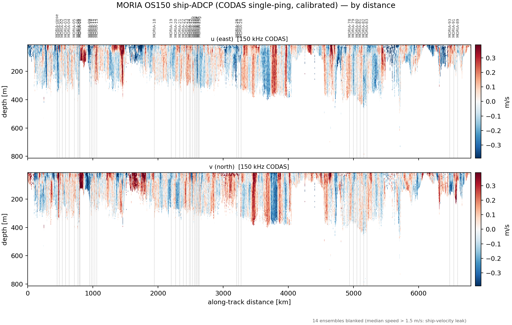

# pyladcp

[](https://github.com/leopenausa/pyladcp/actions/workflows/ci.yml)

**pyladcp turns raw lowered-ADCP (LADCP) casts into ocean velocity profiles, with a
quality report for every station.**

It is a clean-room Python re-implementation of the LDEO_IX
([Visbeck, 2002](https://doi.org/10.1175/1520-0426(2002)019%3C0794:DVPULA%3E2.0.CO;2))
inverse method — the standard LADCP processing workflow — validated cast-by-cast against
legacy LDEO_IX results on two full cruises.
You give it the raw RDI PD0 files from a dual-head (down + up looker) LADCP system and a
CTD cast; it gives you `u`/`v` vs depth, a bottom-track-referenced profile, a QA
scorecard, and a multi-page PDF report per station.

<p align="center">
  
</p>

---

## Requirements

- **Python ≥ 3.10** (3.10–3.12 tested in CI).
- All Python dependencies (numpy, scipy, pandas, xarray, netCDF4, matplotlib, gsw,
  ppigrf) are installed automatically by `pip`. No MATLAB, no compiled code of our own.
- Developed on **Linux**; CI also runs the full test suite on **macOS** and **Windows**.
  Everything in the core workflow (`ladcp-index`, `ladcp-qa`, `ladcp-compare`,
  `ladcp-sadcp-section`) is plain cross-platform Python.

Two **optional** features need extra pieces — you can ignore both to start:

| feature | what it needs | when you need it |
|---|---|---|
| Excel (`.xlsx`) export | `pip install "pyladcp[export]"` (openpyxl) | only for the Excel files; NetCDF/ODV/CSV always work |
| `--from-hex` (build cleaned CTD files from raw SeaBird `.hex`) | the companion [CTD_pipeline](https://github.com/leopenausa/CTD_pipeline) package, cloned next to pyladcp or pointed at with `LADCP_CTD_PROJECT` | only if you don't already have processed 1-s `.cnv` CTD files |

The shipboard-ADCP **CODAS** route (`scripts/codas_*.sh`, see
[`docs/SADCP_CODAS.md`](docs/SADCP_CODAS.md)) is a separate, optional toolchain that is
**Linux/macOS only** (bash + the UHDAS/CODAS suite). It is never required: pyladcp reads
raw VmDAS STA/LTA ship-ADCP files directly on every platform.

## Install

Not on PyPI yet — install from GitHub:

```bash
git clone https://github.com/leopenausa/pyladcp
cd pyladcp
pip install -e .
```

That's it. To verify your installation, run the test suite (ships with a complete
real-data fixture — one full MORIA station, raw PD0s + CTD + the legacy golden result):

```bash
pip install pytest
pytest -q          # expect ~246 passed, ~21 skipped (skips = local-only cruise data)
```

If you prefer conda, `conda env create -f environment.yml` builds a ready `pyladcp` env
with everything in it.

## Quickstart — one station

```bash
# you have: a down-looker PD0, an up-looker PD0, and a processed CTD .cnv
ladcp-qa --down cast-M.000 --up cast-S.000 --ctd cast_clean.cnv \
         --station MyCast --out qa_out
```

Look in `qa_out/stations/MyCast/`:

| file | what it is |
|---|---|
| `MyCast_report.pdf` | **start here** — scorecard (OK / WARN / FAIL) + all figures |
| `MyCast.lad` | the ocean velocity profile (`depth : u : v : error`) |
| `MyCast.bot` | bottom-track-referenced profile near the seabed |
| `MyCast.nc`, `MyCast.xlsx` | the same data as NetCDF / Excel |
| `MyCast_qa.txt`, `.json` | the QA metrics, machine-readable |
| `figures/*.png` | each report figure as a standalone PNG |

Magnetic declination is computed automatically (IGRF-13 from the cast position); override
with `--drot` if you need a specific value.

## Quickstart — a whole cruise

Raw LADCP files carry no station number, so pyladcp first builds an **index** that
anchors each raw file to its cast using the CTD `.hex` header (station label + GPS time).
Four commands, start to finish:

```bash
B=/path/to/cruise            # the folder holding your raw data

# 1. index: which raw file belongs to which station
ladcp-index --root "$B" build --ladcp "$B/raw_ladcp" --ctd "$B/raw_CTD"

# 2. sanity-check the pairing (every station should list a master + slave file)
ladcp-index --root "$B" show

# 3. process every station (+ cruise-level exports)
ladcp-qa --all-stations --index "$B/.ladcp_archive.json" --root "$B" \
         --cruise MYCRUISE -o "$B/qa_out"

# 4. (if a legacy LDEO_IX processing exists) compare station-by-station
ladcp-compare --ours "$B/qa_out" --legacy "$B/legacy_processed" -o "$B/qa_out/legacy_compare"
```

Useful extras for step 3:

- `--sadcp <dir>` — use the ship's ADCP (VmDAS STA/LTA) as an extra constraint on the
  upper ocean. If the ADCP PC's clock was wrong, `--sadcp-timeoff auto --sadcp-nav <track>`
  finds and applies the offset automatically.
- `--from-hex --ctd-cache "$B/ctd_from_hex"` — build the cleaned CTD files from raw
  SeaBird `.hex` (needs CTD_pipeline, see Requirements).
- Any `--cruise` name works: unknown cruises get sensible operator defaults. The LADCP
  dir may be `MASTER/` + `SLAVE/` subdirs **or** one flat directory (heads are told apart
  by the PD0 header); beam-coordinate instruments are rotated to earth automatically.

The full recipe with explanations lives in
[`docs/CRUISE_INGEST.md`](docs/CRUISE_INGEST.md), and there are two printable PDF
quick-guides in [`guide/`](guide/):

- [`guide/ladcp_cli_guide.pdf`](guide/ladcp_cli_guide.pdf) — the two-page CLI recipe +
  full flag reference (good to keep next to the keyboard at sea)
- [`guide/sadcp_codas_guide.pdf`](guide/sadcp_codas_guide.pdf) — one page on processing
  shipboard-ADCP data with CODAS and feeding it back in

The ship-ADCP data itself can be plotted as sections (`ladcp-sadcp-section`, raw VmDAS or
CODAS products, `--anomaly` for the baroclinic view):

<p align="center">
  
</p>

## Using it as a library

```python
import numpy as np

from ladcp.config import moria05_params
from ladcp.io.ctd_cnv import read_ctd_cnv
from ladcp.proc.magdec import magnetic_declination
from ladcp.qa.ingest import load_dualhead
from ladcp.qa.inverse import compute_velocity_full

dh  = load_dualhead("cast-M.000", "cast-S.000", station="MyCast", params=moria05_params())
ctd = read_ctd_cnv("cast_clean.cnv", params=moria05_params())

# magnetic declination from the cast position + date (the CLI does this for you)
drot = magnetic_declination(float(np.nanmedian(ctd.lat)), float(np.nanmedian(ctd.lon)),
                            dh.down.time[0].astype("datetime64[s]").item())

res = compute_velocity_full(dh, ctd, drot=drot)   # res.vp (.lad), res.bp (.bot), res.shear
```

## How well does it work?

Two solvers ship: the default **full constrained inverse** (bottom-track +
GPS-barotropic + optional ship-ADCP constraints, weights tunable via
`--botfac/--barofac/--sadcpfac/--smoofac`) and the classic **shear method**
(`--solver shear`).

Validation against legacy LDEO_IX processings of the same raw data:

| cruise | scope | result |
|---|---|---|
| MORIA 2025 (N Atlantic, 1000+ m casts) | golden station MORIA-80 | `u` corr 0.998 vs legacy; bottom track corr 0.991 |
| a second full cruise (shelf + canyon, beam-coordinate instruments) | 30 stations, zero manual steps | median rms 1.3 cm/s (u), corr 0.97; worst station 3.4 cm/s |

The comparison machinery itself is part of the package (`ladcp-compare`), so you can
reproduce this check on your own cruises.

See [`docs/ROADMAP.md`](docs/ROADMAP.md) for what's next,
[`docs/ARCHITECTURE.md`](docs/ARCHITECTURE.md) for the data interfaces, and
[`docs/SADCP_CODAS.md`](docs/SADCP_CODAS.md) for the CODAS shipboard-ADCP route.

## Troubleshooting

- **`ladcp-index` says "indexed 0 casts"** — the `--ladcp`/`--ctd` paths are wrong or
  empty (a classic cause is an unset `$B` shell variable).
- **Excel files missing from the output** — install the extra:
  `pip install "pyladcp[export]"`. Everything else (NetCDF, ODV, CSV) writes regardless.
- **`raw-CTD ingest needs the CTD_project package`** — you used `--from-hex` without
  CTD_pipeline installed; clone it next to pyladcp or set `LADCP_CTD_PROJECT=/path/to/it`.
- **Running on a headless server** — prefix commands with `MPLBACKEND=Agg`.

## Acknowledgments

pyladcp re-implements the algorithms of the **LDEO_IX** LADCP package by Martin Visbeck
and colleagues (Lamont-Doherty Earth Observatory). The original MATLAB code is not
distributed here. The method is described in:

> Visbeck, M. (2002). Deep velocity profiling using Lowered Acoustic Doppler Current
> Profilers: Bottom track and inverse solutions. *Journal of Atmospheric and Oceanic
> Technology*, 19(5), 794–807.
> [doi:10.1175/1520-0426(2002)019<0794:DVPULA>2.0.CO;2](https://doi.org/10.1175/1520-0426(2002)019%3C0794:DVPULA%3E2.0.CO;2)

The LDEO_IX software itself is maintained at Lamont-Doherty and distributed at
<https://www.ldeo.columbia.edu/~ant/LADCP.html>.

If you use pyladcp in your research, please cite both this package (see
[`CITATION.cff`](CITATION.cff) — GitHub's "Cite this repository" button generates the
reference) and Visbeck (2002).

## License

MIT — see [`LICENSE`](LICENSE).
