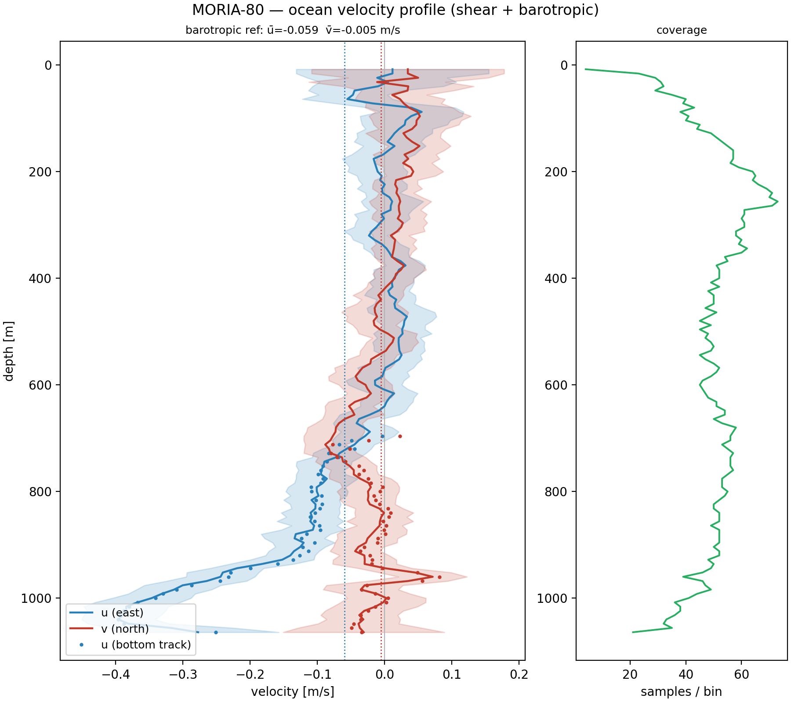

# 4 · First station in 10 minutes

pyladcp's repository ships a **complete real station** as a test fixture: MORIA-80
(N Atlantic, 1073 m), with both raw PD0 files, the cleaned CTD cast, and the legacy
LDEO_IX result it was validated against. You can process a real cast right now, with
nothing but the cloned repository.

!!! tip "Commands on this page are CI-tested"
    Every command below runs in pyladcp's continuous integration against this exact
    fixture. If you can't reproduce what this page shows, something is wrong with your
    installation — see [chapter 3](03-installation.md) and
    [chapter 9](09-troubleshooting.md).

## No real data yet? Generate a synthetic station

If you just `pip install`ed pyladcp and don't have the repository fixtures (or any
cast of your own), generate a **synthetic** dual-head station and process it — a
self-contained demo with no external data:

```bash
ladcp-synth --out synthetic_station --seed 0
ladcp-qa SYNTH-01 --root synthetic_station --out qa_out
```

`ladcp-synth` forward-models a known ocean velocity profile (a thermocline shear in
*u* — an eastward surface layer over a counter-flowing deep layer — with *v* veering
through it) and a seabed, then writes real PD0 + CTD files in the layout below. Because
the truth is known, you can sanity-check the result — it prints the target `ubar`/`vbar`
and seabed depth, and the solved profile should match. The same generator backs
pyladcp's recovery accuracy test (`tests/test_synth_recovery.py`).

The rest of this chapter uses the real **MORIA-80** fixture shipped in the repo.

## The data

From the repository root, the tutorial station lives in the curated layout:

```text
tests/fixtures/New_golden/Good/
├── LADCP/
│   ├── MORIA-80-LADCP-M.000     # master  = down-looker PD0
│   └── MORIA-80-LADCP-S.000     # slave   = up-looker PD0
└── CTD/
    └── moria-80_clean.cnv       # processed 1-s CTD with merged GPS
```

This is the simplest layout pyladcp understands: station-named files under `LADCP/` and
`CTD/`. (Real cruise archives rarely look like this — raw deployment files carry no
station number at all. [Chapter 5](05-cruise-workflow.md) deals with that.)

## Run it

<!-- guide-test -->
```bash
ladcp-qa 80 --root tests/fixtures/New_golden/Good --out qa_out
```

`80` is the station number; `--root` points at the folder holding `LADCP/` and `CTD/`;
pyladcp finds the three files by globbing the station id. After ~30 seconds you'll see:

```text
[WARN ] MORIA-80  ->  qa_out/stations/MORIA-80/
        velocity: qa_out/stations/MORIA-80/MORIA-80.lad  (solver inverse, drot -5.44 deg, ubar -0.055)
        bottom-track: qa_out/stations/MORIA-80/MORIA-80.bot  (47 bins)
        report: qa_out/stations/MORIA-80/MORIA-80_report.pdf
        ...
done: 1 station(s) — 1 warn
```

Three things already happened that you didn't have to ask for:

- the **magnetic declination** was computed from the cast position and date
  (IGRF-13: `drot -5.44 deg`) and applied, so velocities are in true east/north;
- the **full constrained inverse** ran (it is the default solver), blending the
  water-track shear with the bottom-track and GPS constraints;
- a **quality scorecard** was assembled from every processing stage.

## What you get

```text
qa_out/stations/MORIA-80/
├── MORIA-80_report.pdf     ← start here
├── MORIA-80.lad            # the velocity profile:  z  u  v  uerr  (text)
├── MORIA-80.bot            # bottom-track-referenced profile near the seabed
├── MORIA-80.nc             # the same data as CF NetCDF
├── MORIA-80.xlsx           # ... and as Excel (needs pyladcp[export])
├── MORIA-80_qa.txt         # the scorecard, human-readable
├── MORIA-80_qa.json        # the scorecard, machine-readable
└── figures/                # every report figure as a standalone PNG
```

The profile you just produced:

{ width="540" }

## Reading the verdict

Open `MORIA-80_qa.txt`. The overall verdict is **WARN**, and that is the correct,
expected result for this cast — scroll to the one non-OK row:

```text
[WARN] profiling_range_up           [170.11, 154.11, 162.11, 170.11] m
           beam 2 short (154 m); beam 3 short (162 m)
```

Two of the up-looker's four beams achieved less range than their siblings — worth a
note in the cruise report, not a reason to discard the cast. This is the QA layer's
philosophy throughout: **WARN means "a human should glance at this", FAIL means "do not
use this without understanding why"**. Nothing is silently dropped or silently accepted.

A few scorecard rows worth noticing on your first read (all OK here):

| row | what it tells you |
|---|---|
| `ctd_sync_corr 0.975` | the LADCP and CTD clocks were aligned confidently (vertical-velocity correlation) |
| `bottom_depth 1080.7 m ± 0.55` | the seabed was found from 641 bottom echoes |
| `bottom_track_consistency 0.038 m/s` | our own bottom track and the RDI firmware's agree |
| `velocity_error_vs_noise 0.48×` | the formal profile error sits near the data noise floor, as it should |
| `declination -5.441 deg` | IGRF-13 was applied (source is recorded) |

[Chapter 6](06-qa-report.md) explains every row and every report figure in detail.

## The same thing, with explicit files

If your files aren't in any standard layout, skip discovery and name them directly —
this is also the form you'll use for one-off reprocessing:

<!-- guide-test -->
```bash
ladcp-qa --down tests/fixtures/New_golden/Good/LADCP/MORIA-80-LADCP-M.000 \
         --up   tests/fixtures/New_golden/Good/LADCP/MORIA-80-LADCP-S.000 \
         --ctd  tests/fixtures/New_golden/Good/CTD/moria-80_clean.cnv \
         --station MORIA-80 --out qa_out_explicit
```

## Where to go next

- Processing a whole cruise from raw deployment files → [chapter 5](05-cruise-workflow.md)
- What every scorecard metric and figure means → [chapter 6](06-qa-report.md)
- Tuning the solver when a cast is difficult → [chapter 7](07-solvers-weights.md)
