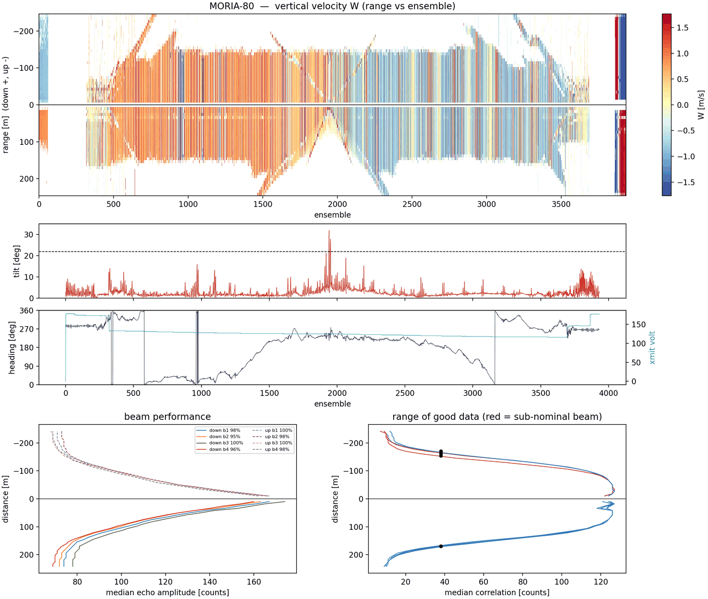
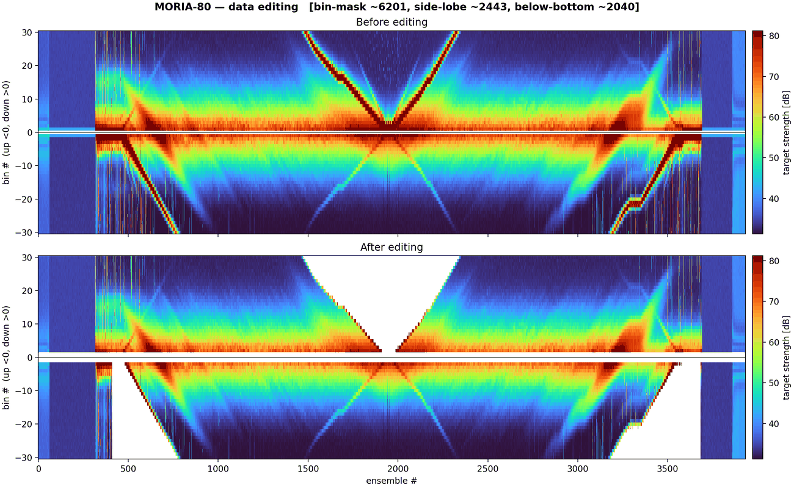
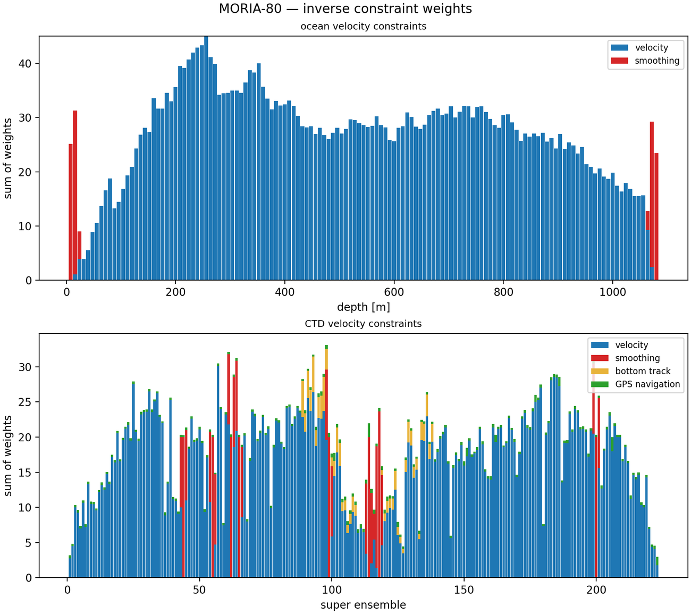
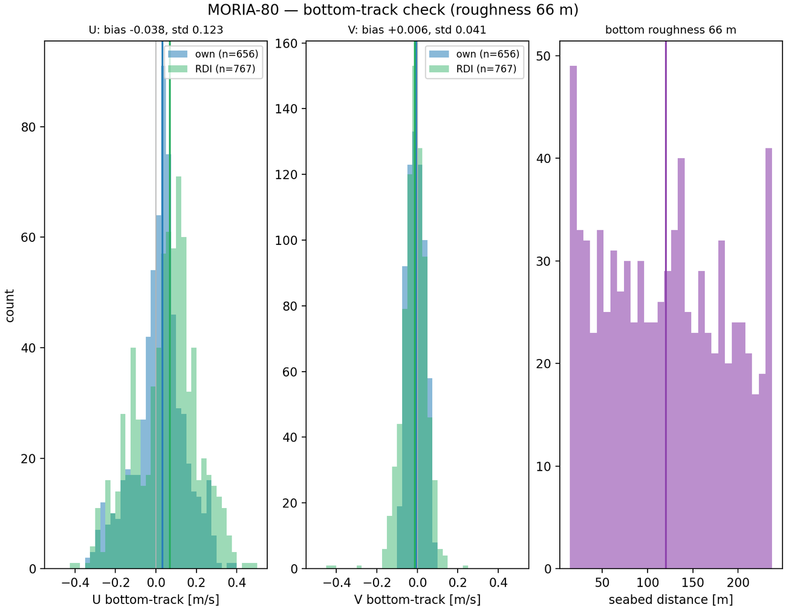

# 6 · Reading the QA report

Every station produces a multi-page PDF report (`<station>_report.pdf`) and a scorecard
(`<station>_qa.txt` / `.json`). This chapter explains **every row of the scorecard and
every figure page** — what each one measures, when it flags, and what to do about it.

## The verdict logic

Each scorecard row is a traffic light, and the strictest light wins:

- **OK** — within the expected range; nothing to do.
- **WARN** — *a human should glance at this.* The cast is still processed and usually
  still usable; the flag tells you what to check before you trust it.
- **FAIL** — *do not use this without understanding why.* The data is genuinely
  defective (e.g. a broken beam).

A cast's overall verdict is FAIL if any row FAILs, WARN if any row WARNs, OK otherwise.
The philosophy throughout: **nothing is silently dropped and nothing is silently
accepted** — every decision the pipeline takes leaves a visible trace here.

---

## The scorecard, row by row

The rows arrive in processing order: editing → instrument health → attitude →
synchronization → depth/seabed → (after the velocity solve) consistency checks.

### Editing counts — `edit_*`

```text
[ok  ] edit_pg_removed_down         59727 cells/ensembles
[ok  ] edit_errvel_removed          4108 cells/ensembles
...
```

How many cells each screening step removed: percent-good (`pg_removed_*`), error
velocity (`errvel_removed`), instantaneous and smoothed tilt (`tilt_removed_gt22`,
`tilt_removed_deriv4`), and implausible horizontal speeds (`hspeed_*`). These rows are
**always OK** — they are bookkeeping, not judgement. Two situations escalate to the
`warnings:` footer instead: a large *fraction* of pings over the tilt limit, and many
`>1 m/s` horizontal velocities in the middle hour of the cast (when the package is deep
and quiet — a classic symptom of acquisition trouble).

**What to do:** compare the counts between similar casts. A station whose counts are
10× its neighbours' had a rough cast — read its edit figure (below) before using it.

### `nearfield_errvel_ratio` — the hung-device detector

Ratio of the down-looker's |error velocity| in the near field (18–42 m below the
package) to the far field (>50 m). **WARN above 1.7** — a rigid target hanging below
the package (a corer, a second instrument, a snagged line) reflects coherent energy
that inflates the near-field error velocity.

**What to do on WARN:** check the deployment log for anything mounted or hung under
the rosette. If confirmed, mask the affected bins (`--nearfield-dn-bins`, or per-cruise
via `edit_nearfield_dn_bins` in the cruise preset) and rerun. The row's note says when
a mask is already active.

### `beam_performance_down` / `_up`

Each beam's signal-to-noise as a percentage of the best beam's.
**WARN below 80%** (weak), **FAIL below 65%** (bad) or **50%** (broken).

**What to do:** a weak beam is worth a note; a FAILed beam means the instrument needs
service — and for this cast, treat the velocities with suspicion (the row's note names
the beam).

### `profiling_range_down` / `_up`

The usable range of each beam, from where its correlation drops off.
**WARN when a beam reaches less than 96% of the best beam's range** — sub-nominal but
not broken, exactly the mild degradation worth tracking across a cruise.

**What to do:** nothing for one cast; watch the trend. A beam whose range shrinks
station after station is ageing hardware. (The tutorial station's WARN in
[chapter 4](04-first-station.md) is this row.)

### `tilt_max` · `battery` · `heading_rotation` · `dual_head_offset_est`

- **`tilt_max`** — largest package tilt; the note carries the mean and the percentage
  of pings over the editing limit (22° by default). **WARN when ≥1% of pings exceed
  the limit** — a wild package (strong currents, bad winch rhythm) loses data to the
  tilt edit.
- **`battery`** — estimated from the transmit voltage (`0.33·xmv`). **WARN below
  40 V.** The conversion factor is board-dependent, so this row **can WARN but never
  FAIL** — treat it as a reminder to check the battery, not a measurement.
- **`heading_rotation`** — total heading span during the cast. Informational: a
  package that spun many turns stresses the compass but is not by itself a problem.
- **`dual_head_offset_est`** — the raw-ping estimate of the up–down mounting angle.
  Informational; the bit-exact value is computed at the velocity stage.

### `coord_frame_down` / `_up`

The coordinate frame each head recorded in. Earth coordinates are OK;
**beam coordinates are rotated to earth automatically at ingest** (using the PD0's
own geometry), so you should normally see `earth` here. Any other frame WARNs and
**gates the velocity solve** — acquisition metrics are still computed, but no profile
is produced from data whose frame is not understood.

### `ctd_sync_corr` · `ctd_sync_locate` · `ctd_sync_coverage`

The LADCP and CTD have independent clocks; pyladcp aligns them by correlating the
package vertical velocity seen by both instruments.

- **`ctd_sync_corr`** — the alignment correlation. **WARN below 0.9.** The note gives
  the clock offset it found and the maximum package depth.
- **`ctd_sync_locate`** — confidence of the coarse search that *finds the cast* inside
  the (possibly much longer) ADCP recording. **WARN below 0.5.**
- **`ctd_sync_coverage`** — fraction of in-water pings carrying valid velocity.
  **WARN below 0.2:** the depth window and the data disagree — the classic signature
  of a **mis-sync** (e.g. the CTD cast mapped onto the ADCP's on-deck pings), which
  would otherwise produce an empty or garbage profile *silently*.

**What to do on any of these:** don't trust the profile yet. Check that the right CTD
file is paired with the right LADCP files (`ladcp-index show`), and look at the depth
figure — the descent/ascent "V" should look like a cast, not noise.

### `start_depth` · `shallow_cast` · `bottom_depth`

- **`start_depth`** — first in-water package depth. **WARN above 50 m**: the recording
  started mid-cast (clipped file) or the sync is off.
- **`shallow_cast`** — flagged for casts **shallower than 100 m**: surface detection
  is disabled there and the thin water column yields few super-ensembles, so the solve
  is weakly constrained. Expect noisier results; see [chapter 7](07-solvers-weights.md)
  for shallow-cast recipes.
- **`bottom_depth`** — the detected seabed and its scatter, from the bottom echoes.
  **WARN when the scatter exceeds 10 m**, when the detection had to fall back to a
  weaker method, or when two independent estimates disagree by more than 25 m.
  A wrong seabed corrupts the near-bottom editing *and* the bottom-track reference —
  on WARN, read the depth figure before using `.bot`.

### Post-solve consistency checks (`checkinv`)

These rows appear after the velocity solve and cross-check the *finished solution*:

- **`velocity_error_vs_noise`** — median formal profile error vs the per-cell residual
  noise floor. They should be the same order of magnitude; **WARN above 2.5×** (the
  solution claims much more uncertainty than the data noise explains — usually a
  weakly constrained solve).
- **`bottom_track_consistency`** — bias between the two independent bottom tracks
  (our own near-seabed-cell track vs the RDI firmware's). **WARN above 0.1 m/s.**
  Disagreement means the near-bottom reference is questionable — see the bottom-track
  figure, and chapter 7 for `--botfac 0`.
- **`sadcp_consistency`** — RMS difference between the LADCP solution and the
  ship-ADCP over their shared depths. **WARN above 0.1 m/s.** The ship-ADCP is an
  independent instrument, so this is the headline external accuracy check.
- **`profile_surface_coverage`** — WARNs when no LADCP velocity exists in the upper
  water column (the ADCP began recording mid-cast): the missing range is **unsampled,
  not zero**.
- **`ship_drift`** — net GPS displacement during the cast; **WARN above 300 m** (the
  ship was not station-keeping; the barotropic reference handles the drift, but a
  moving ship on a long wire leaves residual layback uncertainty).
- **`single_head_solve`** — present (WARN) when the profile was solved from the
  down-looker alone (`--down-only`): reduced near-surface coverage, reference from
  down bins only.
- **`declination`** — the magnetic declination applied, with its provenance (IGRF-13
  from the cast position, or user-supplied). **WARN only when the IGRF lookup failed**
  and the fallback of 0° was used — the profile is then in the *magnetic* frame, not
  true north, and should not be delivered.

---

## The figure pages

Page 1 is the scorecard; each following page renders one figure with a short caption.
The same figures are saved individually under `figures/`. (Figure numbers in
parentheses refer to the legacy LDEO_IX manual's equivalents, for readers coming from
that software.)

### Raw dashboard (legacy Fig. 2)

{ width="640" }

The first look at the raw data: the vertical-velocity "bowtie" (range vs ensemble),
tilt/heading/voltage time series, and per-beam echo amplitude and correlation vs
distance for both heads.

**Healthy:** a clean V-shaped bowtie (descent then ascent), four overlapping beam
curves per head, steady voltage. **Red flags:** a beam whose amplitude/correlation
curve sits far below its siblings (matches the `beam_performance` /
`profiling_range` rows); voltage sagging through the cast; tilt bursts.

### Dual-head alignment (legacy Fig. 6)

Up-minus-down heading/pitch/roll differences plotted against the down-looker's values.
The heading panel shows the sinusoid whose amplitude reveals the mounting offset
between the heads.

**Healthy:** thin, coherent traces. **Red flags:** a scattered cloud (one compass is
unreliable) or a drifting offset (a head physically moved during the cast).

### Surface & seabed detection (legacy Fig. 4)

Package depth vs ensemble with water entry/exit marked, plus the near-seabed detail:
per-ping seabed echoes and the fitted seabed line.

**Healthy:** a clean V with entry/exit where the log says; a tight cluster of bottom
echoes on the fitted line. **Red flags:** entry/exit in the wrong place (mis-sync —
cross-check the `ctd_sync_*` rows); scattered bottom echoes or a fitted line that
chases outliers (`bottom_depth` WARN).

### Editing before/after (legacy Fig. 14)

{ width="640" }

The combined target-strength field before and after the bin-mask, side-lobe and
below-bottom edits. The characteristic **white wedge near the seabed** in the "after"
panel is the removed side-lobe contamination — its absence on a cast that reached the
bottom is itself suspicious.

**What to look for:** the wedge should hug the detected seabed. If good-looking data
above the seabed is also blanked, the detected bottom is too shallow (see
`bottom_depth`); if speckle survives below the seabed line, it is too deep.

### Velocity profile (legacy Fig. 1)

The deliverable: `u`/`v` vs depth with the uncertainty band, the bottom-track points,
and samples-per-bin. Shown in [chapter 4](04-first-station.md) for the tutorial cast.

**Red flags:** the uncertainty band ballooning where samples/bin collapses; the
profile and the bottom-track points disagreeing near the seabed
(`bottom_track_consistency`).

### Shear profile (legacy Fig. 3)

The binned vertical shear, the baroclinic profile integrated from it, and the number
of shear samples per bin — the statistical backbone of the solution.

**Red flags:** shear spikes at a single depth (often one bad bin surviving the edits);
sample counts dropping to single digits over a depth range you care about.

### Inversion diagnostics & constraint weights (legacy Fig. 12)

Two pages: the **decomposition** (baroclinic shape vs absolute solution) with the fit
residual and its distribution — the residual histogram should be tight and centred on
zero — and the **constraint-weights** page:

{ width="640" }

where each constraint (data, smoothing, bottom track, ship-ADCP, GPS) shows *where in
the water column* it actually pulls. Use it with [chapter 7](07-solvers-weights.md):
if a `--botfac`/`--sadcpfac` change "does nothing", this page shows whether the
constraint had any weight to begin with.

### Super-ensemble error (legacy Fig. 3 / `geterr`)

Per-cell residuals about the shared baroclinic shape, plotted over the descent/ascent
"V", plus the median residual per instrument bin (exposing range-dependent bias) and
the resolved velocity field.

**Red flags:** residual stripes tied to specific bins (instrument problem) vs patches
in time (ocean variability or a passing disturbance); far bins much noisier than near
bins is normal — the per-bin panel shows how much.

### Ship & package drift map

The ship's GPS track and the package's dead-reckoned track in local east/north metres.

**Healthy:** both within tens of metres on a station-keeping cast; the gap between
them is the package's real excursion below the ship. **Red flags:** hundreds of metres
of ship drift (see `ship_drift`) — expect a larger layback uncertainty.

### Bottom-track check (legacy Fig. 13 / `checkbtrk`)

{ width="640" }

The two independent bottom tracks (own: blue, RDI firmware: green) overlaid, with
medians, inter-method bias and scatter annotated, plus the detected seabed.

**Healthy:** the two clouds sit on top of each other (bias ≪ 0.1 m/s). **Red flags:**
a systematic offset between them (`bottom_track_consistency` WARN) — the near-bottom
reference is in doubt; consider `--botfac 0` and let the GPS-barotropic constraint
carry the reference ([chapter 7](07-solvers-weights.md)).

### Ship-ADCP comparison (legacy Fig. 9) — when `--sadcp` was given

The ship-ADCP profile (points, with scatter) over the LADCP solution (lines), and
their difference vs depth.

**Healthy:** agreement within ~5 cm/s over the shared range (`sadcp_consistency`).
**Red flags:** a constant offset (suspect the LADCP reference: bottom track, drift)
vs a depth-dependent divergence (suspect the shear integration or the ship-ADCP's
own data quality at range).

---

## A triage recipe for a whole cruise

1. Sort `exports/<CRUISE>_summary.csv` by verdict; count FAILs (rare) and WARNs.
2. For each **FAIL**: read its named row — almost always instrument hardware
   (`beam_performance`). Decide explicitly whether to deliver the cast at all.
3. For each **WARN**: this chapter's row entry tells you which figure to open and
   which knob ([chapter 7](07-solvers-weights.md)) or fix
   ([chapter 9](09-troubleshooting.md)) applies.
4. Spot-check a few **OK** casts' velocity pages anyway — OK means *no flag tripped*,
   not *certified perfect*.
