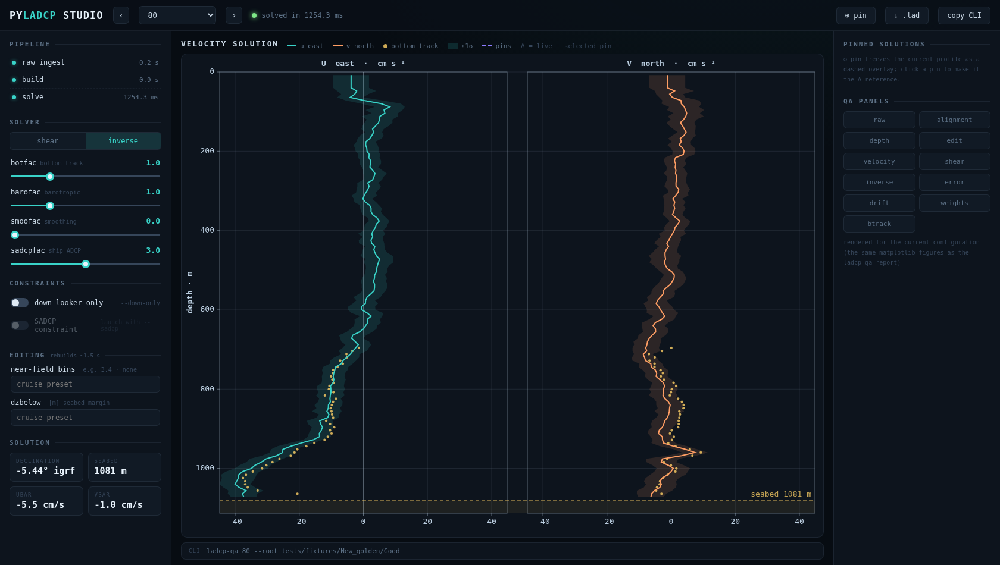

# 10 · Interactive Studio

`ladcp-studio` is a local web GUI for **single-station, interactive** processing: the
velocity profile re-renders live while you move the solver weights, toggle constraints,
or change the editing options. It runs the exact same engine as `ladcp-qa` — the
results are bit-identical, enforced by the test suite — so anything you find in Studio,
`ladcp-qa` reproduces.

Use it for the decisions chapter 7 describes: *should this cast get `--down-only`? does
the SADCP constraint fight the bottom track here? what does `smoofac` actually cost
me?* Instead of a re-run per question, you watch the answer continuously.



## Install & launch

The GUI dependencies (FastAPI + uvicorn) are an optional extra:

```bash
pip install -e ".[gui]"
```

Launch it the same way you would call `ladcp-qa` — station ids plus the discovery
context. With the repository's built-in test station:

```bash
ladcp-studio 80 --root tests/fixtures/New_golden/Good
```

The browser opens by itself (suppress with `--no-browser`; the server is
localhost-only). Everything you know from `ladcp-qa` carries over:

```bash
ladcp-studio 80 79 --root "$B" --cruise MYCRUISE          # several stations, ‹ › to switch
ladcp-studio --index "$B/.ladcp_archive.json" --root "$B" # every cast in the archive index
ladcp-studio 80 --sadcp "$B/sADCP/DATA"                   # enable the ship-ADCP constraint
ladcp-studio 80 --sadcp "$B/sADCP/DATA" \
             --sadcp-codas "$B/codas/os150nb_enr"         # raw AND a CODAS product
```

`--sadcp` works exactly as in `ladcp-qa` (chapter 8) and is validated at launch — if
the folder doesn't directly hold the `.STA` files, the error tells you which subfolder
does.

The **SADCP constraint toggle** turns the ship-ADCP rows on and off; the **source
dropdown** under it picks which product feeds them. It lists every `--sadcp` folder
(repeatable — e.g. the 75 and 150 kHz instruments), every `--sadcp-codas` product
(chapter 8 / the CODAS guide), and any CODAS products **found automatically** under
the conventional `<root>/codas/` — those are marked *(found)* and never become the
default constraint; selecting one is your explicit choice. Pin a solution, switch
the source, and the Δ-strip shows what the instrument or the processing chain is
worth at this station. Each choice is still a single `ladcp-qa` command
(`--sadcp <path> [--sadcp-source codas]`), shown in the CLI bar as always. The
full flag list:

<!-- guide-test -->
```bash
ladcp-studio --help
```

## The screen

- **Left rail** — the processing state. *Pipeline* shows per-stage timings; *Solver*
  is `shear`/`inverse` plus the four weights of chapter 7; *Constraints* toggles
  `--down-only` and the SADCP rows; *Editing* exposes the near-field bin mask and
  `dzbelow`. Hover any control for a condensed explanation.
- **Center** — the live u/v profile with its ±1σ band, bottom-track points, the
  ship-ADCP constraint (white squares) when active, and the seabed line. The bar
  underneath always shows **the `ladcp-qa` command that reproduces the current
  state** — `copy CLI` puts it on the clipboard.
- **Right** — pinned solutions and the QA panels (the same matplotlib figures as the
  `ladcp-qa` report, rendered on demand for the *current* configuration).

## The two speeds

Controls are grouped by what they cost, and the grouping is the point:

| tier | controls | cost |
|---|---|---|
| solve | solver, `botfac`, `barofac`, `smoofac`, `sadcpfac`, SADCP toggle | **~30 ms** — drag and watch |
| build | `--down-only`, near-field bins, `dzbelow` | **~1.5 s** — rebuilds editing → bottom detect → super-ensembles |

The first visit to a station pays raw ingest + build once (~1–2 s on the test
station); after that, weight changes are effectively instantaneous.

## A workflow that works

1. Solve with defaults, press **⊕ pin** — that's your baseline, frozen as a dashed
   ghost.
2. Change *one thing* (chapter 7's rule applies in Studio too). The **Δ-strip** under
   the profile shows live − pin against depth, so a 2 cm/s shift confined to the upper
   300 m reads at a glance.
3. Run the standard cross-checks without leaving the page: `shear` vs `inverse`,
   dual vs `--down-only` — pin one, switch, read the Δ.
4. Found a configuration you trust? **copy CLI** and run it in your batch script, or
   **↓ .lad** to download the profile directly (byte-identical to the `ladcp-qa`
   output).

Studio is a *diagnosis* tool: it holds one station at a time (the three most recent
stay cached) and writes nothing to disk by itself. Production outputs — reports,
exports, the cruise aggregate — stay with `ladcp-qa` (chapter 5), fed by the command
line Studio hands you.
